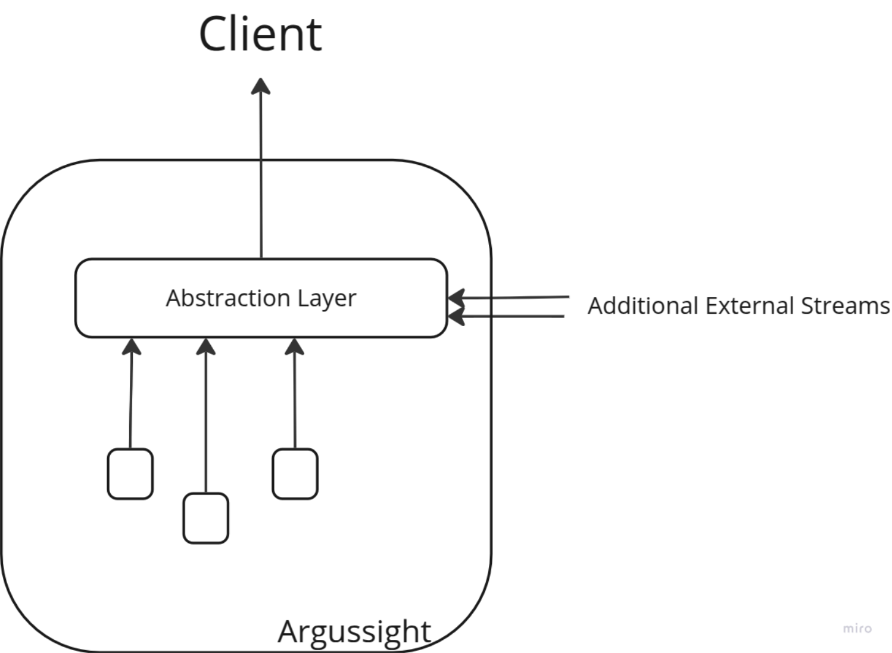

# Understanding and Customizing the Abstraction Layer

The abstraction layer bridges outgoing streams with connections from other projects, ensuring a seamless and consistent way to forward WebSocket (WS) connections. This design decouples stream handling from client connections, improving scalability and maintainability.



---

## Features

- **Stream Forwarding**: Automatically forwards outgoing streams via WebSocket connections.
- **Decoupled Architecture**: Abstracts stream generation from client handling, enabling easier integration with external projects.
- **Source Obfuscation**: Stream sources are hidden from connecting clients. Client applications only interact with the abstraction layer via its exposed port, ensuring that the actual stream source locations remain concealed. (see [benefits](overview.md#benefits-of-source-obfuscation))
- **Scalable**: Supports multiple simultaneous connections without direct dependencies on stream sources.
- **Customizable**: Configurable behaviour to meet specific project (functional or security) needs.

---

## Configuration

Currently there is no seperate configuration file, instead configurations related to the Abstraction-Layer (i.e. Running port) can be made through the [root configuration file](../usage/configurations.md#root-configuration).

---

## Adding/Removing Streams

There are two ways to add/remove streams to/from the Abstraction-Layer, depending on where your stream is running/being added from.

### As an Argussight process

One option is to run a process within Argussight. In this case, ensure that your process inherits from the [Streamer](vprocess.md#streamer) class. This allows Argussight's [Spawner](spawner.md) to manage the stream, ensuring it is correctly added and removed when your process is created and terminated. The stream can be accessed by using the [unique name](vprocess.md#) of the process. For more details on accessing the streams from the Abstraction-Layer, see [below](#access-streams).

### From outside the Argussight architecture

Argussight supports adding any stream to the Abstraction-Layer. Streams can be added through the corresponding gRPC request ([AddStreamRequest](../usage/grpc.md#available-requests)). While any *MJPEG* or *MPEG1* stream can be added, we highly recommend using [MXCuBE's Video-Streamer](https://github.com/mxcube/video-streamer) to generate the stream. Below is an example of how to generate and add a stream to the Abstraction-Layer via the [gRPC](../usage/grpc.md) connection.

```python
import argussight.grpc.argus_service_pb2 as pb2
import argussight.grpc.argus_service_pb2_grpc as pb2_grpc
import grpc
import uuid

# Create channel connection
channel = grpc.insecure_channel("localhost:50051") # replace with the location of your GRPC channel
stub = pb2_grpc.SpawnerServiceStub(channel)

# Create a test video-stream
port = "8000"
stream_hash = str(uuid.uuid1())
subprocess.Popen(
                [
                    "video-streamer",
                    "-uri",
                    "test",
                    "-hs",
                    "localhost",
                    "-p",
                    port,
                    "-of",
                    "MPEG1",
                    "-id",
                    stream_hash,
                ],
                close_fds=True,
            )

# Add Stream to the Abstraction Layer
try:
    stub.AddStream(
        pb2.AddStreamRequest(
            name="TestStream",
            port=port,
            stream_id=stream_hash,
        )
    )
except Exception:
    print("Couldn't add stream")
```

> **Note**: The `name` argument serves as the unique identifier for a stream. If you add two streams with the same name, the first stream will be removed and replaced by the second.

---

## Access Streams

To access an added stream, you must establish a WebSocket connection to `ws://<host>:<port>/ws/<name>`, where `<host>` and `<port>` refer to the host and port of the abstraction-layer, and `<name>` is the unique identifier of the stream you wish to access.

### Get a list of all available streams

To get a list of all accessable streams, a request ([GetProcessesRequest](../usage/grpc.md#available-requests)) can be send to Argussight via gRPC. The `response` to that request contains information about all the processes and streams registered within the running Argussight server. To extract the identifiers of the streams from the `responses` body, you can do as follows:

```python
import argussight.grpc.argus_service_pb2 as pb2
import argussight.grpc.argus_service_pb2_grpc as pb2_grpc
import grpc

# Create channel connection
channel = grpc.insecure_channel("localhost:50051") # replace with the location of your GRPC channel
stub = pb2_grpc.SpawnerServiceStub(channel)

# Fetch the stream names
try:
    response = stub.GetProcesses(pb2.GetProcessesRequest())
    if response.status = "success":
        stream_names = list(response.streams)
    else:
        print(f"Error occured when fetching processes {response.error_message}")
except Exception:
    print("Error occured when connecting to the server")
```
